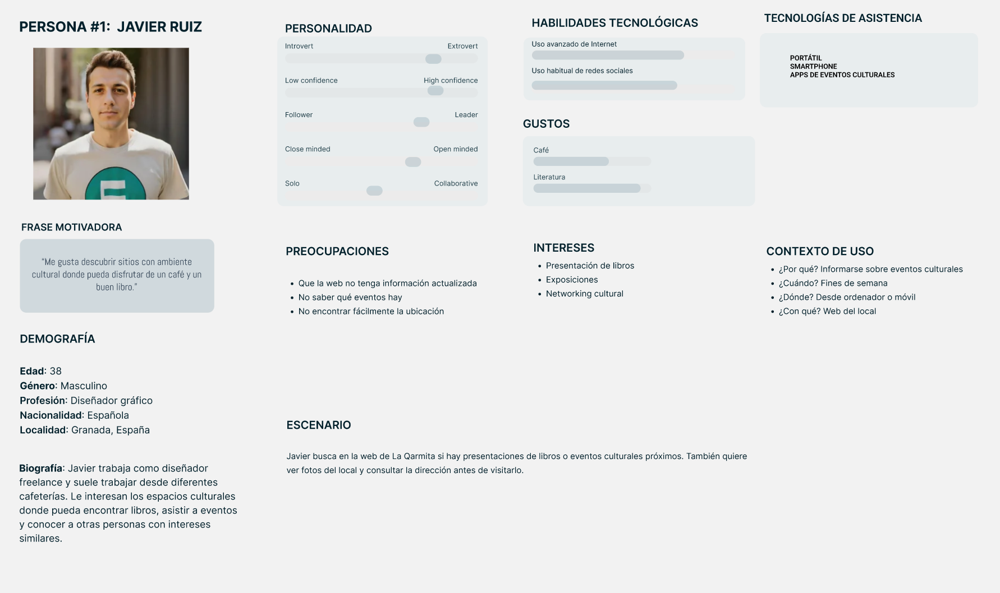
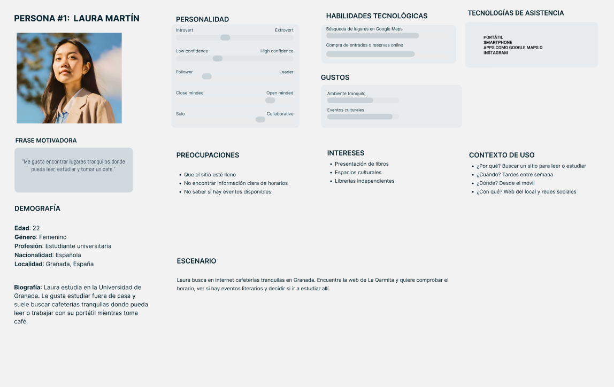
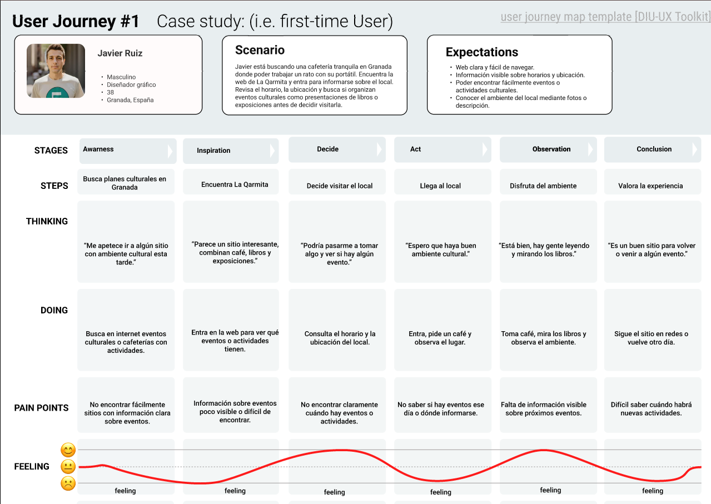
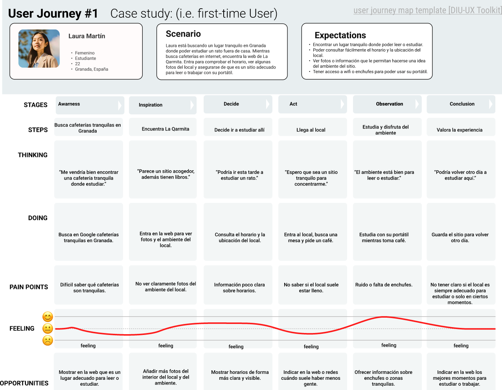

# DIU26
Prácticas Diseño Interfaces de Usuario (Tema: .... ) 

* [Guiones de prácticas](GuionesPracticas/)
* [Guía para crea tu Case Study](Guia_CaseStudy.md)
* Sala de la Fama [DIU Hall of fame](https://github.com/mgea/DIU/tree/master/hall_of_fame) donde se pueden encontrar Case Study destacados de otros años.

Actualizado: 14/01/2026

## Paso 0 My UX-Case Study
 
-----

>>> Este documento es el esqueleto del Case Study que explica el proceso de desarrollo de las 5 prácticas de DIU. Aparte de subir cada entrega a PRADO, se debe actualizar y dar formato de informe final a este documento online. Elimine este tipo de texto / comentarios desde la práctica 1 conforme proceda a cada paso

>>> Hay que Publicar de forma incremental "my Case Study" en Github... Es el momento de dejar este documento para que sea evaluado y calificado como parte de la práctica
>>> Documente bien la cabecera y asegurese que ha resumido los pasos realizados para el diseño de su producto

Grupo: DIU2_EA.  Curso: 2025/26 

Nombre del Proyecto: La Estantería de Sabores

>>> Decida el nombre corto de su propuesta en la práctica 2 

Descripción: 

>>> Describa la idea de su producto en la práctica 2 

Logotipo: 

>>> Si diseña un logotipo para su producto en la práctica 3 pongalo aqui, a un tamaño adecuado. Si diseña un slogan añadalo aquí

Miembros y nombre del equipo:
 * :bust_in_silhouette:  Eyas Alsaadi Nwelati     :octocat:     
 * :bust_in_silhouette:  Andrea Martínez García     :octocat:

>>> Los equipos son de 2 personas. Identifícaros con el nombre del Grupo y los enlaces a los perfiles de GitHub de cada integrante

----- 

 

# Proceso de Diseño 

 

## Paso 1. UX User & Desk Research & Analisis 

>>> Cualquier título puede ser adaptado. Recuerda borrar estos comentarios del template en tu documento

### 1.a User Reseach Plan
 
-----

En nuestro proyecto realizaremos un estudio sobre la página web de “La Qarmita Libros, Café & Eventos”, una cafetería-librería cultural situada en Granada que combina servicio de café, venta de libros y organización de eventos como exposiciones, presentaciones o talleres. En nuestro caso estamos familiarizados con este tipo de lugares, ya que solemos visitar cafeterías y librerías similares.

El objetivo principal del estudio es analizar la facilidad de uso de la página web y comprobar si los usuarios pueden encontrar la información principal de forma rápida y clara. También se buscará identificar posibles problemas de navegación, como dificultades para localizar horarios, la ubicación del local o la información sobre eventos.

Para ello se realizarán pruebas con usuarios en las que deberán completar tareas como encontrar horarios o eventos. Además, se recogerán sus opiniones mediante encuestas breves y se realizará una revisión de usabilidad de la página.

Enlace al pdf: [User Research Plan](P1/User_research_plan.pdf)

### 1.b Competitive Analysis
 
-----
Para realizar este análisis, hemos seleccionado dos plataformas competidoras que nos permiten contrastar la evolución del negocio y su posicionamiento en el mercado local de Granada. El objetivo es identificar las carencias de nuestra opción principal (La Qarmita - Blog) frente a soluciones más modernas o populares.

Los competidores seleccionados son: 
1. **La Qarmita (Web Actual):** Seleccionada para evaluar la evolución de la marca. Aunque mejora el diseño visual, es necesario comprobar si han mejorado también otros aspectos.
2. **Epicureum :** Tras investigar en comunidades como Reddit, hemos identificado este local como uno de los sitios más recomendados en Granada para leer y estudiar en calma. A pesar de no ser una "librería-café" estrictamente, es su competencia directa por el tipo de usuario y la experiencia que ofrece. Lo elegimos por poseer una web moderna frente a otros negocios similares en la ciudad que carecen de presencia online.

Para la comparativa, hemos utilizado esta escala:

<kbd>⭐ Pobre: No cumple con los estándares mínimos.</kbd>
<kbd>⭐⭐ Básico: Cumple la función pero con deficiencias claras.</kbd>
<kbd>⭐⭐⭐ Bueno: Experiencia de usuario satisfactoria.</kbd>
<kbd>⭐⭐⭐⭐ Excelente: Referente en su categoría. </kbd>

[Ver Competitor Analysis](P1/Competitor_Analysis.pdf)

Tras el análisis, observamos que mientras Epicureum destaca en diseño visual y 'responsiveness' (adaptación móvil), La Qarmita (en ambas versiones) flaquea en la jerarquía de contenidos y accesibilidad técnica. Esto nos indica que nuestra propuesta de rediseño debe enfocarse en profesionalizar la estructura de la información y facilitar la navegación para usuarios que buscan un espacio tranquilo y bien organizado.

### 1.c Personas
 
-----

Para esta práctica hemos elegido dos perfiles de personas diferentes y con intereses distintos. Por un lado, Laura es una estudiante universitaria que busca cafeterías tranquilas donde poder leer, estudiar y disfrutar de un café en un ambiente relajado. Por otro lado, Javier es un diseñador gráfico interesado en espacios culturales donde pueda trabajar ocasionalmente, descubrir libros y asistir a eventos como presentaciones o exposiciones.

### 1.d User Journey Map
 
----

La experiencia de Javier refleja algo bastante habitual cuando alguien busca un sitio con ambiente cultural. Muchas personas descubren este tipo de lugares buscando en internet cafeterías diferentes o espacios donde haya actividades culturales. Al encontrar la web, lo normal es revisarla para ver el horario, la ubicación o si hay eventos.

En este caso, Javier se interesa por el concepto del lugar, pero tiene algunas dudas al no encontrar fácilmente información clara sobre los eventos. El journey muestra este proceso y permite identificar puntos donde la información podría presentarse de forma más clara para mejorar la experiencia del usuario.

La experiencia de Laura representa una situación bastante habitual cuando alguien busca un sitio tranquilo para estudiar o leer fuera de casa. Muchas personas recurren a internet para encontrar cafeterías donde poder concentrarse durante un rato. Al encontrar la web del local, lo primero que suelen hacer es mirar el horario, la ubicación o intentar hacerse una idea del ambiente del sitio.

En el caso de Laura, el lugar le resulta interesante, pero tiene algunas dudas porque no encuentra fácilmente información o fotos que le ayuden a saber si el ambiente es adecuado para estudiar. El journey refleja este proceso y permite ver algunos puntos donde la información podría mostrarse de forma más clara para facilitar la decisión del usuario.

### 1.e Usability Review
 
----
Proceso de evaluación de la página web La Qarmita, donde comprobamos diferentes puntos y si debería de mejorarlos. En dicho estudio evaluamos diferentes apartados, como lo son la funcionalidad, la navegación la búsqueda o el rendimiento de la página
- Enlace al documento:  [Usability-Review](P1/Usability-Review-LaQarmita.pdf)
- Valoración numérica obtenida: 49-Poor
- Comentario: A pesar de que el tono de voz es excelente y los textos son cercanos, la incapacidad de la estructura para guiar a los usuarios hacia tareas básicas (como consultar horarios o agenda futura) y la saturación visual de la interfaz degradan la experiencia hasta un nivel Poor (Deficiente), ya que los usuarios no logran completar sus objetivos principales con éxito.

 

## Paso 2. UX Design  

>>> Cualquier título puede ser adaptado. Recuerda borrar estos comentarios del template en tu documento

### 2.a Reframing / IDEACION: Feedback Capture Grid / EMpathy map 
 
----
Hemos realizado el Mapa de Empatía centrándonos en el usuario interesado en el concepto de Café-Librería. De este modo, entendemos que su frustración no es solo con una interfaz, sino con la falta de conexión entre la magia del local físico y la frialdad de su plataforma actual. Nuestra propuesta de 'Sabores con Encanto' busca cerrar esa brecha emocional

 Interesante | Críticas     
| ------------- | -------
  Preguntas | Nuevas ideas
  

**propuesta de valor**

A raíz de los hallazgos en el mapa de empatía, nos planteamos cómo transformar una plataforma actualmente desactualizada en una experiencia digital que realmente respire cultura y cercanía. Nos surgen preguntas clave: ¿Y si la web no fuera solo un tablón de anuncios, sino un refugio digital que anticipe la calma del local?. ¿Y si pudiéramos maridar visualmente el sabor de un café artesanal con la recomendación de un libro antes incluso de llegar al establecimiento?

[Nombre proyecto] nace con esa premisa: crear una plataforma web clara, envolvente y accesible donde cualquier usuario —desde el estudiante que busca concentración hasta el diseñador que busca inspiración— pueda descubrir una agenda cultural viva y una carta de productos honestos. Nuestra propuesta de valor consiste en digitalizar el encanto de La Qarmita, transformando un blog estático en una plataforma experiencial. Queremos que el usuario sienta la misma calidez y orden que encuentra en la librería física, facilitando la conexión entre sus ganas de disfrutar un buen café (Sabores) y su interés por la cultura local (Encanto).

Esta digitalización se basa en:
1.**Conexión Emocional:** Usar un diseño visual y una narrativa (storytelling) que transmita la calidez de la librería-café, algo que el blog actual no hace.
2.**Claridad y Utilidad funcional:** Facilitar la toma de decisiones mediante una Agenda Cultural clara, una Carta de Sabores e información del local. En esta información se especificará la disponibilidad de servicios (WiFi, zonas de enchufes y política de ruido). Además, el sistema de Reserva de Espacio permitirá al usuario asegurar requisitos específicos (como un enchufe), eliminando la incertidumbre de antes de salir de casa.
3.**Accesibilidad e Inclusión:** Asegurar que la web sea usable para todos, corrigiendo los fallos técnicos de jerarquía y estructura que detectamos en el análisis anterior.

### 2.b ScopeCanvas

----

>>> Propuesta de valor, pero ahora en vez de un texto es un ScopeCanvas que has subido a P2/ y enlazado desde aqui. Tambien vale una imagen miniatura del recurso.
>>> No olvides que tu propuesta ya tiene un nombre corto y puedes actualizar la cabecera de este archivo

### 2.b User Flow (task) analysis 
 
-----
En nuestra matriz de tareas de usuario, hemos recopilado las funciones de nuestra web y como de relevante serian para cada tipo de usuario, dando las prioridades de alta(H), media(M) y baja(L):
| User Groups | Laura | Javier | Dueño del local |
| :--- | :---: | :---: | :---: |
| Consultar horario/localización | H | H | L |
| Consultar servicios disponibles | H | M | M |
| Explorar carta de "Sabores"(fotos) | H | H | M |
| Consultar evento en agenda cultural (calendario) | M | H | H |
| Reservar espacio | H | M | L |
| Compartir evento en RRSS | L | H | M |
| Gestionar/subir eventos | - | - | H |
| Consultar el archivo | L | H | L |
 >>> Prioridades para Laura: Dado que busca un "refugio" para concentrarse, las tareas de horario y estado de calma son críticas (H) para evitar la frustración de llegar y no encontrar el ambiente adecuado.

>>> Prioridades para Javier: Como usuario interesado en la identidad visual y la cultura, su foco principal es la Agenda Cultural y el Archivo histórico (H), buscando una conexión emocional con la marca.

 Aquí mostramos el flujo de las tareas (task flows) que hemos considerado las mas relevantes:
 
 **Consultar evento en Agenda Cultural**
 **Reservar espacio**
 

### 2.c IA: Sitemap + Labelling 
 
----

>>> Identificar términos para diálogo con usuario (evita el spanglish) y la arquitectura de la información. Es muy apropiado un diagrama tipo sitemap y una tabla que se ampliaría para llevar asociado la columna iconos (tanto para la web como para una app). 

Término | Significado     
| ------------- | -------
  Login  | acceder a plataforma

### 2.d Wireframes
 
-----

>>> Plantear el diseño del layout para Web/movil (organización y simulación). Describa la herramienta usada 

 

## Paso 3. Mi UX-Case Study (diseño)

>>> Cualquier título puede ser adaptado. Recuerda borrar estos comentarios del template en tu documento

### 3.a Moodboard

-----

>>> Diseño visual con una guía de estilos visual (moodboard) 
>>> Incluir Logotipo. Todos los recursos estarán subidos a la carpeta P3/
>>> Explique aqui la/s herramienta/s utilizada/s y el por qué de la resolución empleada. Reflexione ¿Se puede usar esta imagen como cabecera de Instagram, por ejemplo, o se necesitan otras?

### 3.b Landing Page
 
----

>>> Plantear el Landing Page del producto. Aplica estilos definidos en el moodboard

### 3.c Guidelines
 
----

>>> Estudio de Guidelines y explicación de los Patrones IU a usar 
>>> Es decir, tras documentarse, muestre las deciones tomadas sobre Patrones IU a usar para la fase siguiente de prototipado. 

### 3.d Mockup
 
----

>>> Consiste en tener un Layout en acción. Un Mockup es un prototipo HTML que permite simular tareas con estilo de IU seleccionado. Muy útil para compartir con stakeholders

 

## Paso 4. Pruebas de Evaluación 

### 4.a Reclutamiento de usuarios 

-----

>>> Breve descripción del caso asignado (llamado Caso-B) con enlace al repositorio Github
>>> Tabla y asignación de personas ficticias (o reales) a las pruebas. Exprese las ideas de posibles situaciones conflictivas de esa persona en las propuestas evaluadas. Mínimo 4 usuarios: asigne 2 al Caso A y 2 al caso B.

| Usuarios | Sexo/Edad     | Ocupación   |  Exp.TIC    | Personalidad | Plataforma | Caso
| ------------- | -------- | ----------- | ----------- | -----------  | ---------- | ----
| User1's name  | H / 18   | Estudiante  | Media       | Introvertido | Web.       | A 
| User2's name  | H / 18   | Estudiante  | Media       | Timido       | Web        | A 
| User3's name  | M / 35   | Abogado     | Baja        | Emocional    | móvil      | B 
| User4's name  | H / 18   | Estudiante  | Media       | Racional     | Web        | B 

### 4.b Diseño de las pruebas 
 
-----

>>> Planifique qué pruebas se van a desarrollar. ¿En qué consisten? ¿Se hará uso del checklist de la P1?

### 4.c Cuestionario SUS
 
----

>>> Como uno de los test para la prueba A/B testing, usaremos el **Cuestionario SUS** que permite valorar la satisfacción de cada usuario con el diseño utilizado (casos A o B). Para calcular la valoración numérica y la etiqueta linguistica resultante usamos la [hoja de cálculo](https://github.com/mgea/DIU19/blob/master/Cuestionario%20SUS%20DIU.xlsx). Previamente conozca en qué consiste la escala SUS y cómo se interpretan sus resultados
http://usabilitygeek.com/how-to-use-the-system-usability-scale-sus-to-evaluate-the-usability-of-your-website/)
Para más información, consultar aquí sobre la [metodología SUS](https://cui.unige.ch/isi/icle-wiki/_media/ipm:test-suschapt.pdf)
>>> Adjuntar en la carpeta P4/ el excel resultante y describa aquí la valoración personal de los resultados 

### 4.d A/B Testing
 
-----

>>> Los resultados de un A/B testing con 3 pruebas y 2 casos o alternativas daría como resultado una tabla de 3 filas y 2 columnas, además de un resultado agregado global. Especifique con claridad el resultado: qué caso es más usable, A o B?

### 4.e Aplicación del método Eye Tracking 

----

>>> Indica cómo se diseña el experimento y se reclutan los usuarios. Explica la herramienta / uso de gazerecorder.com u otra similar. Aplíquese únicamente al caso B.

  
>>> Cambiar esta img por una de vuestro experimento. El recurso deberá estar subido a la carpeta P4/  

>>> gazerecorder en versión de pruebas puede estar limitada a 3 usuarios para generar mapa de calor (crédito > 0 para que funcione) 

### 4.f Usability Report de B
 
-----

>>> Añadir report de usabilidad para práctica B (la de los compañeros) aportando resultados y valoración de cada debilidad de usabilidad. 
>>> Enlazar aqui con el archivo subido a P4/ que indica qué equipo evalua a qué otro equipo.

>>> Complementad el Case Study en su Paso 4 con una Valoración personal del equipo sobre esta tarea

 

## Paso 5. Exportación y Documentación 

### 5.a Exportación a HTML/React
 
----

>>> Breve descripción de esta tarea. Las evidencias de este paso quedan subidas a P5/

### 5.b Documentación con Storybook

----

>>> Breve descripción de esta tarea. Las evidencias de este paso quedan subidas a P5/

 

## Conclusiones finales & Valoración de las prácticas

>>> Opinión FINAL del proceso de desarrollo de diseño siguiendo metodología UX y valoración (positiva /negativa) de los resultados obtenidos. ¿Qué se puede mejorar? Recuerda que este tipo de texto se debe eliminar del template que se os proporciona 

