# DIU26
Prácticas Diseño Interfaces de Usuario (Tema: .... ) 

* [Guiones de prácticas](GuionesPracticas/)
* [Guía para crea tu Case Study](Guia_CaseStudy.md)
* Sala de la Fama [DIU Hall of fame](https://github.com/mgea/DIU/tree/master/hall_of_fame) donde se pueden encontrar Case Study destacados de otros años.

Actualizado: 14/01/2026

## Paso 0 My UX-Case Study
 
-----

Grupo: DIU2_EA.  Curso: 2025/26 

Nombre del Proyecto: La Estantería de Sabores
Web: [Pincha aqui](https://la-estanteria-de-sabores.surge.sh)

Descripción: 
La Estantería de sabores es el rediseño digital de La Qarmita, un espacio donde la cultura y la gastronomía se entrelazan. El proyecto nace para transformar una plataforma desactualizada en un refugio digital que anticipe la calma del local físico.  

Logotipo: 
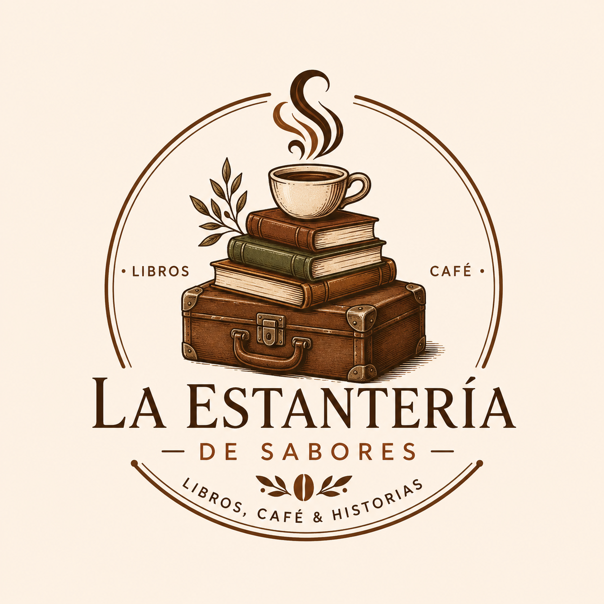

*Donde cada página tiene un aroma y cada café cuenta una historia*

Miembros y nombre del equipo:
 * :bust_in_silhouette:  Eyas Alsaadi Nwelati     :octocat:     [Eyas04](URL_del_enlace)
 * :bust_in_silhouette:  Andrea Martínez García     :octocat: [andreaxmarrtinezz](URL_del_enlace)

----- 

 

# Proceso de Diseño 

 

## Paso 1. UX User & Desk Research & Analisis 

### 1.a User Reseach Plan
 
-----

En nuestro proyecto realizaremos un estudio sobre la página web de “La Qarmita Libros, Café & Eventos”, una cafetería-librería cultural situada en Granada que combina servicio de café, venta de libros y organización de eventos como exposiciones, presentaciones o talleres. En nuestro caso estamos familiarizados con este tipo de lugares, ya que solemos visitar cafeterías y librerías similares.

El objetivo principal del estudio es analizar la facilidad de uso de la página web y comprobar si los usuarios pueden encontrar la información principal de forma rápida y clara. También se buscará identificar posibles problemas de navegación, como dificultades para localizar horarios, la ubicación del local o la información sobre eventos.

Para ello se realizarán pruebas con usuarios en las que deberán completar tareas como encontrar horarios o eventos. Además, se recogerán sus opiniones mediante encuestas breves y se realizará una revisión de usabilidad de la página.

Enlace al pdf: [User Research Plan](P1/User_research_plan.pdf)

### 1.b Competitive Analysis
 
-----
Para realizar este análisis, hemos seleccionado dos plataformas competidoras que nos permiten contrastar la evolución del negocio y su posicionamiento en el mercado local de Granada. El objetivo es identificar las carencias de nuestra opción principal (La Qarmita - Blog) frente a soluciones más modernas o populares.

Los competidores seleccionados son: 
1. **La Qarmita (Web Actual):** Seleccionada para evaluar la evolución de la marca. Aunque mejora el diseño visual, es necesario comprobar si han mejorado también otros aspectos.
2. **Epicureum :** Tras investigar en comunidades como Reddit, hemos identificado este local como uno de los sitios más recomendados en Granada para leer y estudiar en calma. A pesar de no ser una "librería-café" estrictamente, es su competencia directa por el tipo de usuario y la experiencia que ofrece. Lo elegimos por poseer una web moderna frente a otros negocios similares en la ciudad que carecen de presencia online.

Para la comparativa, hemos utilizado esta escala:

<kbd>⭐ Pobre: No cumple con los estándares mínimos.</kbd>
<kbd>⭐⭐ Básico: Cumple la función pero con deficiencias claras.</kbd>
<kbd>⭐⭐⭐ Bueno: Experiencia de usuario satisfactoria.</kbd>
<kbd>⭐⭐⭐⭐ Excelente: Referente en su categoría. </kbd>

[Ver Competitor Analysis](P1/Competitor_Analysis.pdf)

Tras el análisis, observamos que mientras Epicureum destaca en diseño visual y 'responsiveness' (adaptación móvil), La Qarmita (en ambas versiones) flaquea en la jerarquía de contenidos y accesibilidad técnica. Esto nos indica que nuestra propuesta de rediseño debe enfocarse en profesionalizar la estructura de la información y facilitar la navegación para usuarios que buscan un espacio tranquilo y bien organizado.

### 1.c Personas
 
-----

Para esta práctica hemos elegido dos perfiles de personas diferentes y con intereses distintos. Por un lado, Laura es una estudiante universitaria que busca cafeterías tranquilas donde poder leer, estudiar y disfrutar de un café en un ambiente relajado. Por otro lado, Javier es un diseñador gráfico interesado en espacios culturales donde pueda trabajar ocasionalmente, descubrir libros y asistir a eventos como presentaciones o exposiciones.

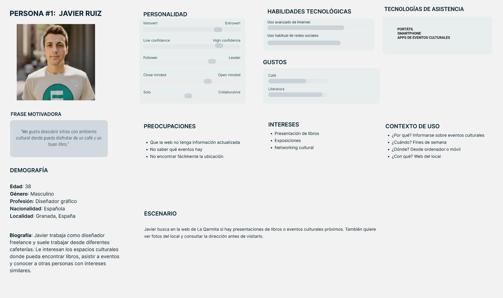

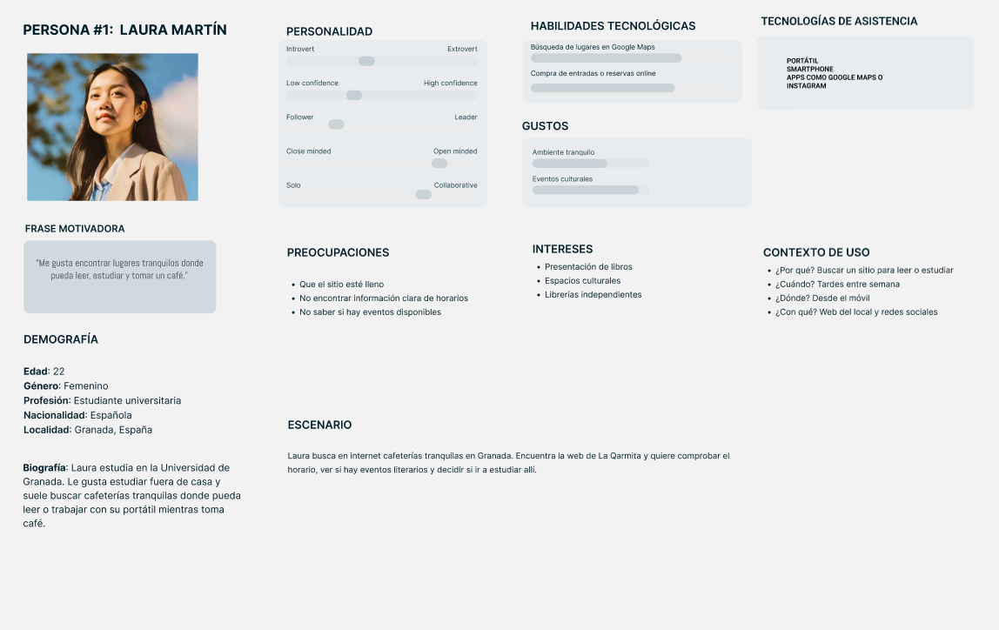

### 1.d User Journey Map
 
----

La experiencia de Javier refleja algo bastante habitual cuando alguien busca un sitio con ambiente cultural. Muchas personas descubren este tipo de lugares buscando en internet cafeterías diferentes o espacios donde haya actividades culturales. Al encontrar la web, lo normal es revisarla para ver el horario, la ubicación o si hay eventos.

En este caso, Javier se interesa por el concepto del lugar, pero tiene algunas dudas al no encontrar fácilmente información clara sobre los eventos. El journey muestra este proceso y permite identificar puntos donde la información podría presentarse de forma más clara para mejorar la experiencia del usuario.

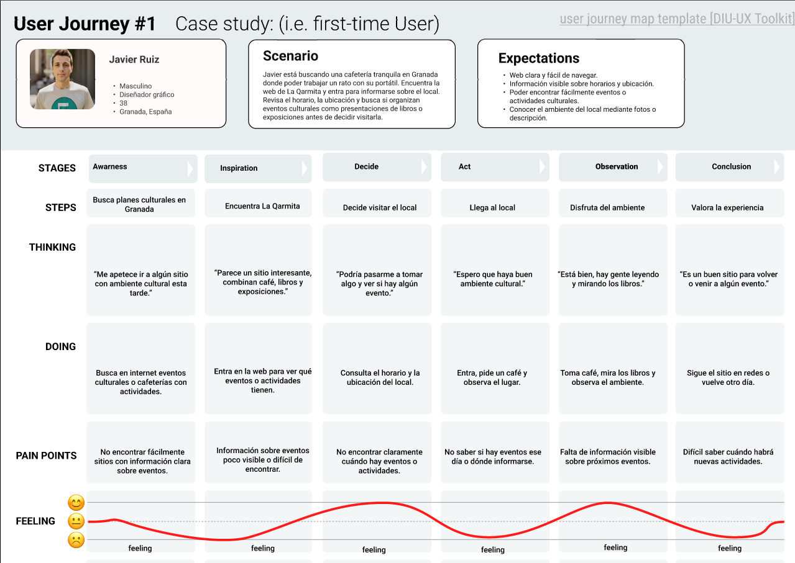

La experiencia de Laura representa una situación bastante habitual cuando alguien busca un sitio tranquilo para estudiar o leer fuera de casa. Muchas personas recurren a internet para encontrar cafeterías donde poder concentrarse durante un rato. Al encontrar la web del local, lo primero que suelen hacer es mirar el horario, la ubicación o intentar hacerse una idea del ambiente del sitio.

En el caso de Laura, el lugar le resulta interesante, pero tiene algunas dudas porque no encuentra fácilmente información o fotos que le ayuden a saber si el ambiente es adecuado para estudiar. El journey refleja este proceso y permite ver algunos puntos donde la información podría mostrarse de forma más clara para facilitar la decisión del usuario.

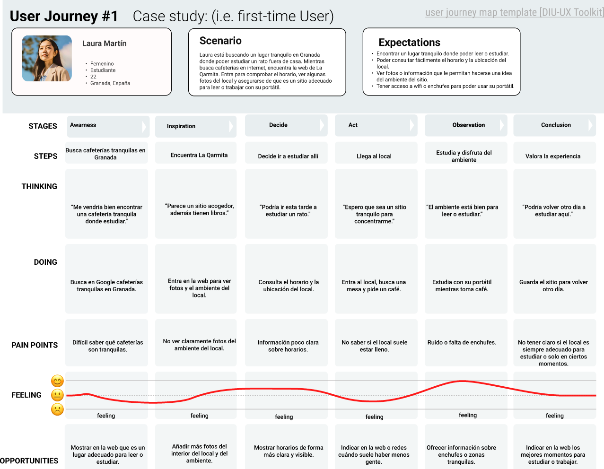

### 1.e Usability Review
 
----
Proceso de evaluación de la página web La Qarmita, donde comprobamos diferentes puntos y si debería de mejorarlos. En dicho estudio evaluamos diferentes apartados, como lo son la funcionalidad, la navegación la búsqueda o el rendimiento de la página
- Enlace al documento:  [Usability-Review](P1/Usability-Review-LaQarmita.pdf)
- Valoración numérica obtenida: 49-Poor
- Comentario: A pesar de que el tono de voz es excelente y los textos son cercanos, la incapacidad de la estructura para guiar a los usuarios hacia tareas básicas (como consultar horarios o agenda futura) y la saturación visual de la interfaz degradan la experiencia hasta un nivel Poor (Deficiente), ya que los usuarios no logran completar sus objetivos principales con éxito.

 

## Paso 2. UX Design  

>>> Cualquier título puede ser adaptado. Recuerda borrar estos comentarios del template en tu documento

### 2.a Reframing / IDEACION: Feedback Capture Grid / EMpathy map 
 
----
Hemos realizado el Mapa de Empatía centrándonos en el usuario interesado en el concepto de Café-Librería. De este modo, entendemos que su frustración no es solo con una interfaz, sino con la falta de conexión entre la magia del local físico y la frialdad de su plataforma actual. Nuestra propuesta de 'Sabores con Encanto' busca cerrar esa brecha emocional
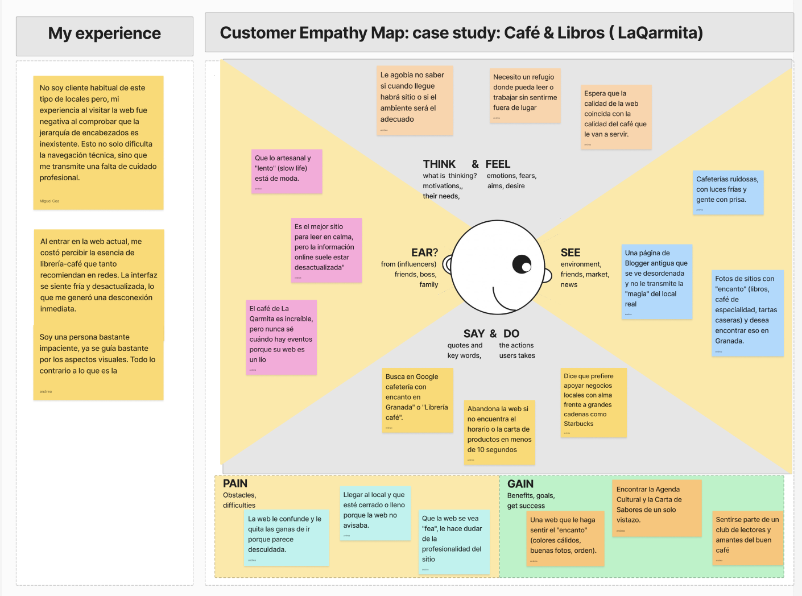
  

**Propuesta de valor**

A raíz de los hallazgos en el mapa de empatía, nos planteamos cómo transformar una plataforma actualmente desactualizada en una experiencia digital que realmente respire cultura y cercanía. Nos surgen preguntas clave: ¿Y si la web no fuera solo un tablón de anuncios, sino un refugio digital que anticipe la calma del local?. ¿Y si pudiéramos asegurarnos un espacio incluso antes de llegar al local?

La Estantería de Sabores nace con esa premisa: crear una plataforma web cercana, clara, funcional y accesible.

Por ello, nuestra propuesta de valor se basa en:
1. **Conexión Emocional:** Usar un diseño visual y una narrativa (storytelling) que transmita la calidez de la librería-café.
2. **Claridad y Utilidad funcional:** Facilitar la toma de decisiones mediante una Agenda Cultural clara, una Carta de Sabores e información del local. En esta información se especificará la disponibilidad de servicios (WiFi, zonas de enchufes y política de ruido). Además, el sistema de Reserva de Espacio permitirá al usuario asegurar requisitos específicos (como un enchufe), eliminando la incertidumbre de antes de salir de casa.
3. **Accesibilidad e Inclusión:** Asegurar que la web sea usable para todos, corrigiendo los fallos técnicos de jerarquía y estructura que detectamos en el análisis anterior.

### 2.b ScopeCanvas

----

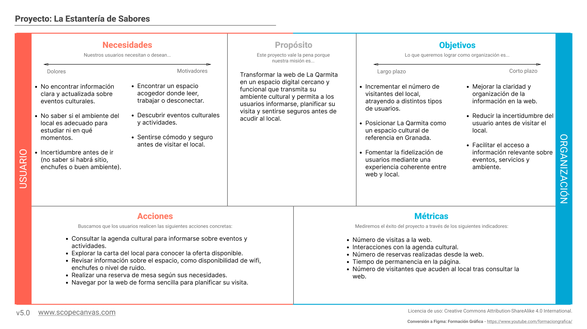

### 2.b User Flow (task) analysis 
 
-----
En nuestra matriz de tareas de usuario, hemos recopilado las funciones de nuestra web y como de relevante serian para cada tipo de usuario, dando las prioridades de alta(H), media(M) y baja(L):
| User Groups | Laura | Javier | Dueño del local |
| :--- | :---: | :---: | :---: |
| Consultar horario/localización | H | H | L |
| Consultar servicios disponibles | H | M | M |
| Explorar carta de "Sabores"(fotos) | H | H | M |
| Consultar evento en agenda cultural (calendario) | M | H | H |
| Reservar espacio | H | M | L |
| Compartir evento en RRSS | L | H | M |
| Gestionar/subir eventos | - | - | H |
| Consultar el archivo | L | H | L |

 Aquí mostramos el flujo de las tareas (task flows) que hemos considerado las mas relevantes:
 

 **Reservar espacio**
 
 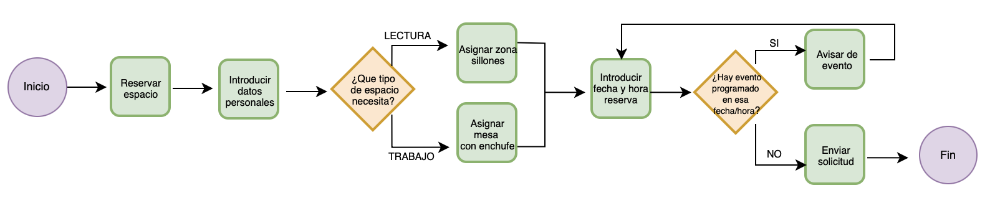

  **Consultar evento en Agenda Cultural**
  
 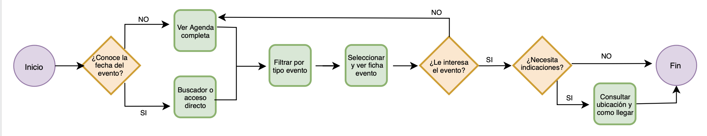

### 2.c IA: Sitemap + Labelling 
 
----

  **Sitemap**
  
 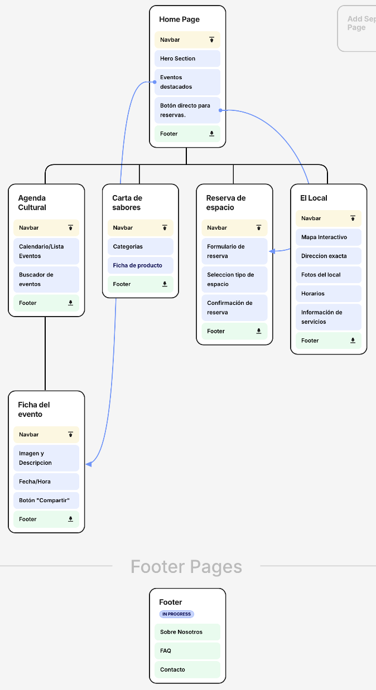

 **Labelling** 
#### Página: HOME
| Etiqueta | Info | Icono |
| :--- | :--- | :---: |
| Hero Section | Espacio de bienvenida con un lema y fotografía representativa del local. | ✨ | 
| Eventos destacados | Resumen visual de los 3 próximos eventos más importantes de la agenda. | ⭐ |
| Botón reserva | Acceso directo al formulario de reserva de espacio. | ⚡ | 
#### Página: AGENDA CULTURAL
| Etiqueta | Info | Icono |
| :--- | :--- | :---: |
| Calendario/Lista | Visualización de eventos por fechas con etiquetas de categoría (Cine, Libros, Música) | 🗓️ | 
| Buscador de eventos | Filtro para encontrar actividades específicas por nombre o temática. | 🔍 |
| Ficha de evento| Página detalle con descripción,fecha... | 📄 | 
#### Página: CARTA DE SABORES
| Etiqueta | Info | Icono |
| :--- | :--- | :---: |
| Categorías | Clasificación de la carta: Cafés, Tés, Repostería y Opciones Saladas. | 📋 | 
| Ficha de producto | Foto del producto, precio, ingredientes y alérgenos | 🍰 |
#### Página: RESERVA
| Etiqueta | Info | Icono |
| :--- | :--- | :---: |
| Formulario de reserva|Formulario para introducir Nombre,Teléfono (necesarios para la notificación), Fecha y Hora.| 👤 |
| Selección tipo de espacio| Selección obligatoria entre: Espacio de Trabajo (con enchufe) o Lectura (relax)| 💻 / 🛋️ |
| Confirmación de reserva | Feedback visual de 'Reserva enviada' que incluye un resumen de esta| ✅ |
#### Página: EL LOCAL
| Etiqueta | Info | Icono |
| :--- | :--- | :---: |
| Mapa Interactivo | Integración de Google Maps con la ubicación exacta en Granada | 📍 |
| Fotos del local | Galería de imagenes del local | 📸 |
| Horarios | Tabla detallada de apertura, cierre y horarios especiales en festivos. | ⏰ |
| Info de servicios| Detalle de servicios: WiFi alta velocidad, Zonas de carga y Política de ruido | 📶 / 🔌 |
#### Página: FICHA DEL EVENTO
| Etiqueta | Info | Icono |
| :--- | :--- | :---: |
| Imagen y descripción| Fotografía representativa y texto detallado sobre el artista, autor o temática del evento. | 🖼️ |
| Fecha/hora | Información clara sobre el día y momento del inicio, incluyendo la duración estimada. | 📅 |
| Botón Compartir| Opción para difundir el evento en Redes Sociales o enviar por WhatsApp a amigos | 🔗 |
#### Elementos Globales
| Etiqueta | Info | Icono |
| :--- | :--- | :---: |
| Navbar| Menú superior con: Inicio, Agenda, Sabores, Reserva y El Local | 🧭 |
| Sobre Nosotros| Historia de la Qarmita | 🤝🏻|
| FAQ | Preguntas frecuentes | ❓|
| Contacto | Correo y teléfono del local | 📞 |

### 2.d Wireframes
 
-----

>>> Plantear el diseño del layout para Web/movil (organización y simulación). Describa la herramienta usada 

 

## Paso 3. Mi UX-Case Study (diseño)

>>> Cualquier título puede ser adaptado. Recuerda borrar estos comentarios del template en tu documento

### 3.a Moodboard

-----
El moodboard de La Estantería de Sabores recoge los principales elementos de identidad visual para el rediseño digital de La Qarmita: logotipo, paleta de colores, arquitectura tipográfica, imágenes de inspiración y perfiles de usuario. El logotipo fue generado por la inteligencia artificial al igual que las imagenes del local.

Para su desarrollo, se ha utilizado la plantilla base del espacio de la asignatura en Figma, adaptándola mediante una lógica de diseño atómico para estructurar de forma clara y coherente los cimientos del sistema visual (Foundations). De cara a una futura estrategia en redes sociales, el formato se adaptaría a composiciones verticales o cuadradas, priorizando la estética acogedora del local y el detalle de su agenda cultural.
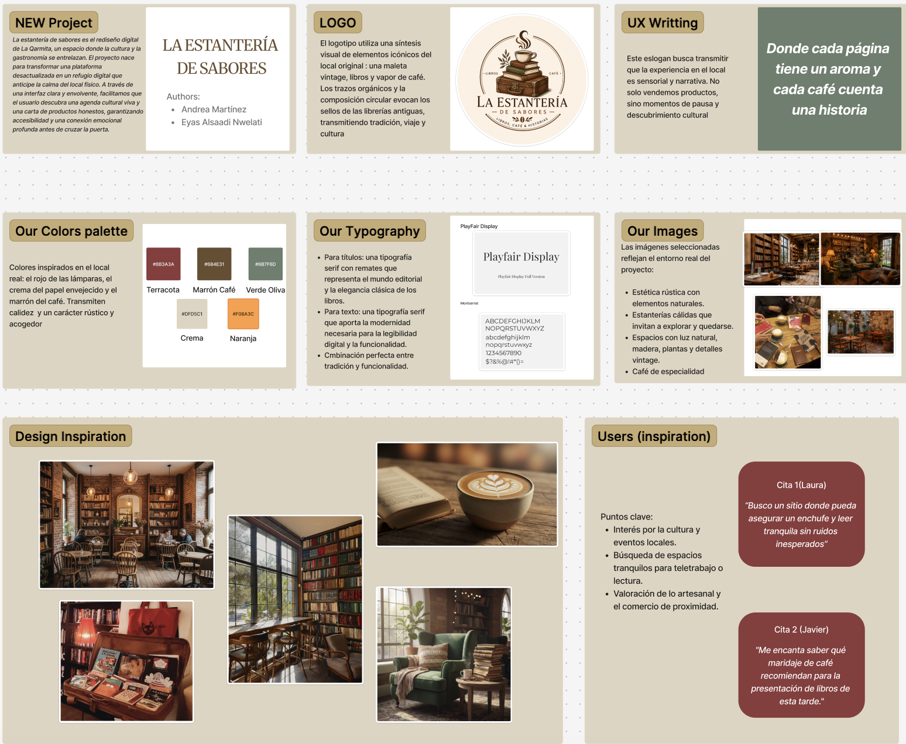

### 3.b Landing Page
 
----
>>> No hay que hacerla.

### 3.c Guidelines
 
----
Las Guidelines de La Estantería de Sabores establecen las reglas y principios visuales que rigen la identidad digital del proyecto, asegurando que la esencia bohemia y acogedora de La Qarmita se mantenga consistente en cada pantalla. Este documento define el uso del sistema cromático *Rustic & Warm* y la arquitectura tipográfica (combinando la elegancia clásica de *Playfair Display* con la legibilidad moderna de *Montserrat*). No se trata solo de una guía estética, sino de un marco normativo que garantiza la accesibilidad, el contraste óptimo y la armonía visual.

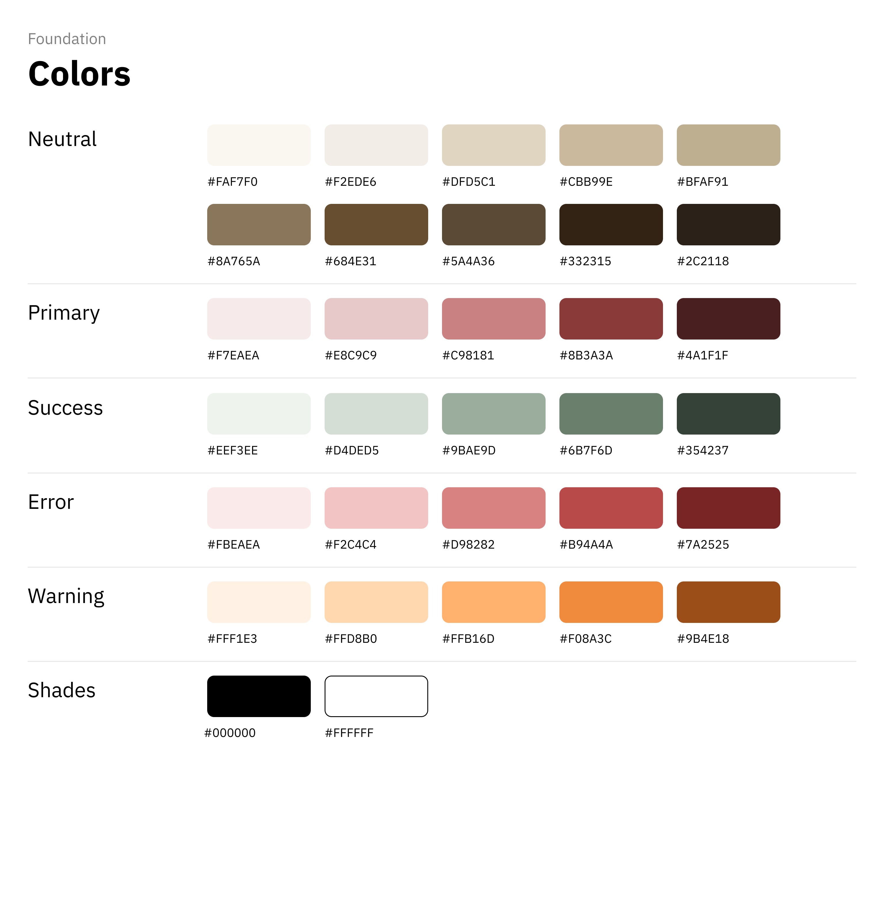
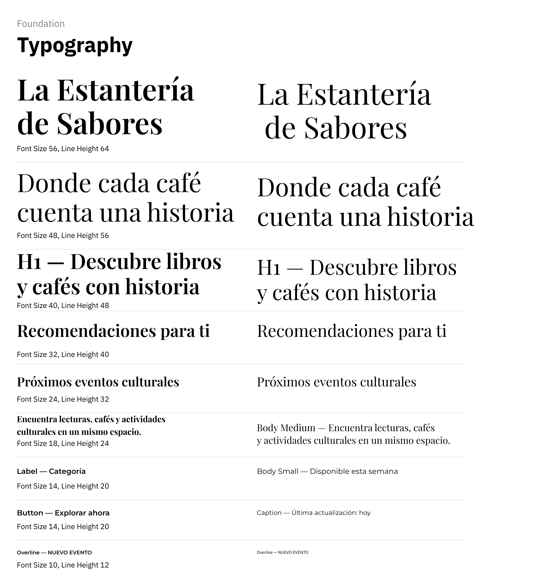
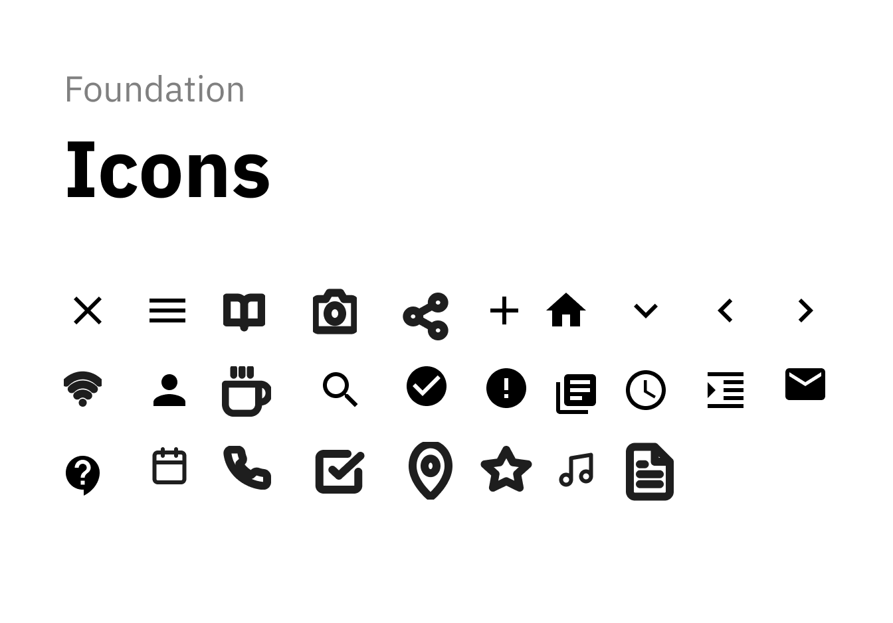
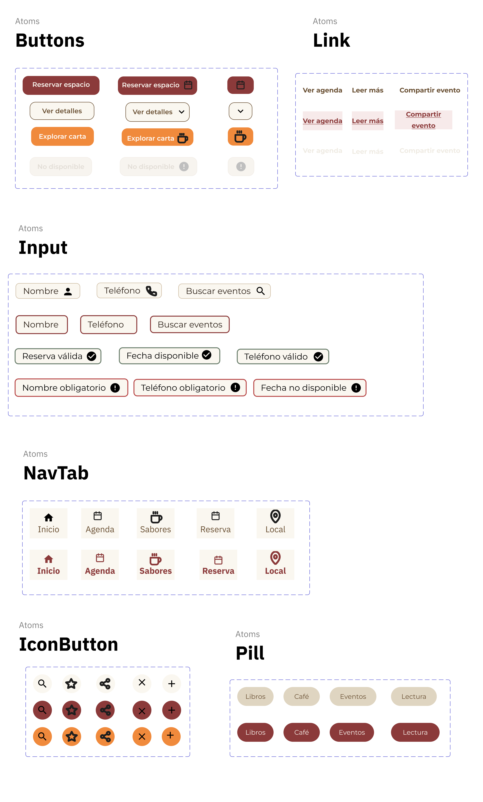
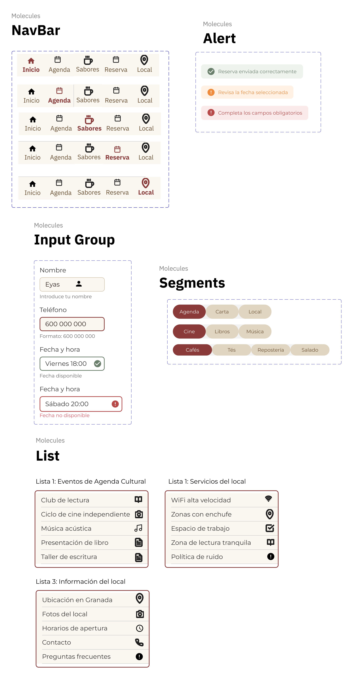
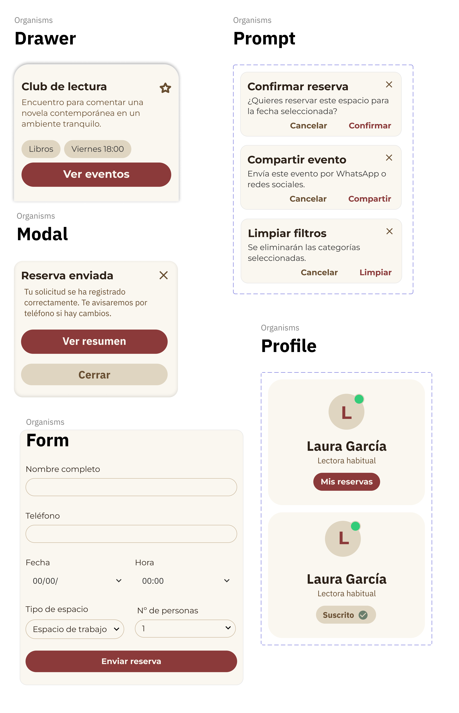

### 3.d Mockup
 
----
Los Mockups representan la fase visual definitiva y estática del proyecto para ordenador , donde la estructura del layout se viste por completo con el sistema de diseño (Design System) personalizado. Estas maquetas de alta fidelidad muestran con total realismo cómo lucirá la plataforma web de La Estantería de Sabores.

Al optar por un formato de escritorio, se aprovecha al máximo la amplitud de la pantalla para recrear la atmósfera Rustic & Warm de La Qarmita. Mediante el uso de imágenes, tipografías con carácter editorial y contrastes cromáticos optimizados, los mockups consiguen trasladar el encanto bohemio del local físico al entorno digital. Cada interfaz ha sido diseñada para guiar de forma intuitiva tanto a usuarios que buscan reservar un espacio de estudio en calma, como a aquellos que desean explorar la  agenda cultural de Granada.
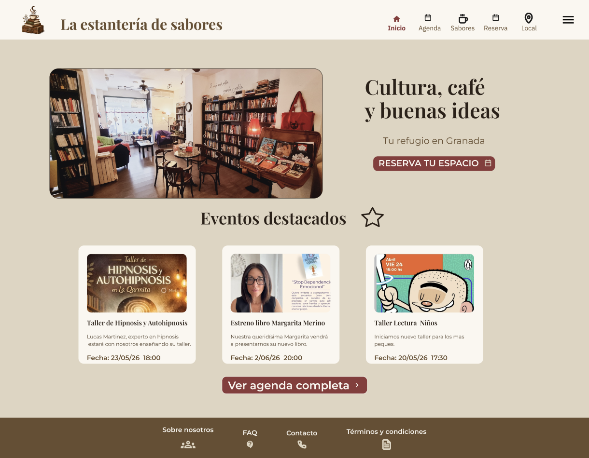
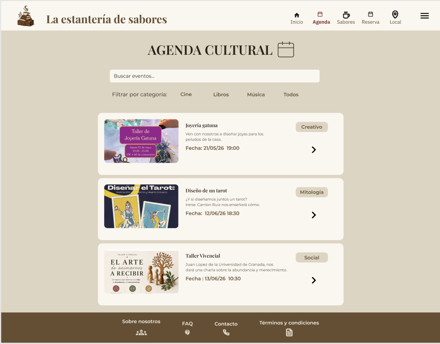
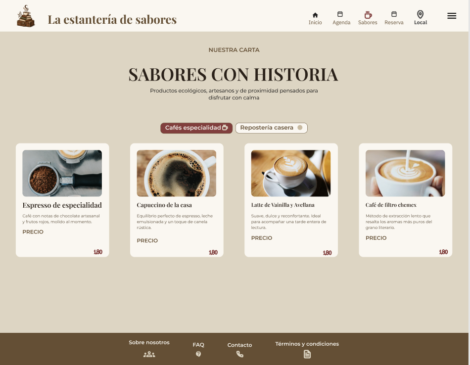
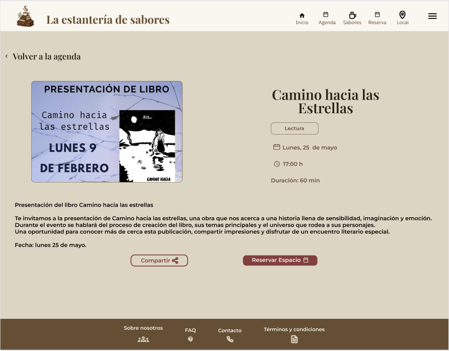
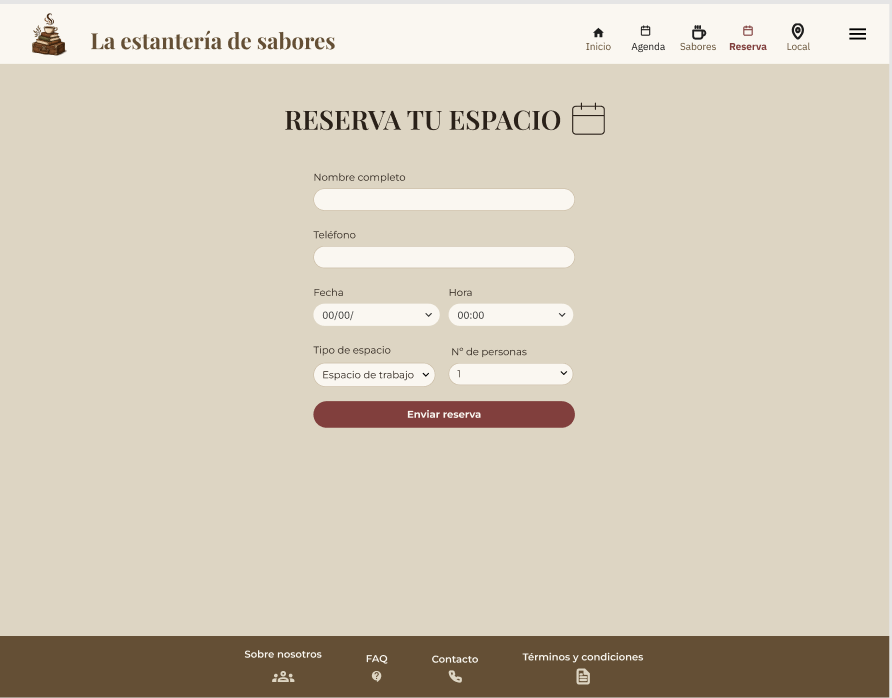
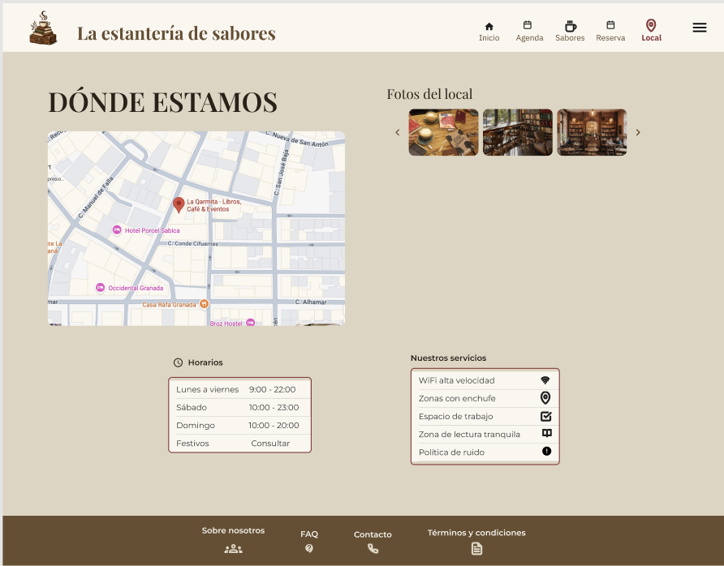

 

## Paso 4. Pruebas de Evaluación 

### 4.a Reclutamiento de usuarios 

-----
El Caso B que se nos ha asignado (tras sustituir la propuesta inicial no disponible) es **GoikoMes**, una plataforma web interactiva basada en un sistema de votación y cocreación gastronómica en colaboración con la cadena Goiko. Su concepto principal busca alejarse por completo de las webs de comida a domicilio tradicionales y estáticas, apostando por hacer partícipe directo a la comunidad gourmet.  

Para diferenciarse de su competencia, GoikoMes toma la iniciativa de gamificar la experiencia culinaria: cada mes, los clientes pueden explorar y votar su hamburguesa favorita entre 3 propuestas nuevas creadas por el propio staff y chefs de la marca (como "La Infernal", la burger líder actual). La opción ganadora se mantiene en la carta durante todo el mes siguiente, incentivando la fidelización y el retorno recurrente de los usuarios a la web.  

Por último, cabe destacar que su principal propuesta de valor a nivel de diseño es la transparencia y el reconocimiento. Desarrollan un sistema web de estética oscura y muy potente visualmente que otorga todo el protagonismo tanto al producto real como a sus creadores, facilitando la validación de la comunidad a través de reseñas detalladas y un desglose nítido de los ingredientes para garantizar una navegación intuitiva y de alto impacto.  

El **repositorio** del proyecto es: [Web Goiko Mes](https://github.com/Practicas-DIU3-RESCUE/UX_CaseStudy).  

Para la evaluación cruzada del Caso B se han utilizado los siguientes recursos:

- Prototipo interactivo en Figma: https://www.figma.com/design/A6rDPMsQQNoGCJOEQcfLrb/Sin-t%C3%ADtulo?node-id=0-1&t=Pm9RMPRkGWGsdZhS-1
- Sitio web en producción: https://jorge-goikomes.surge.sh
- Carpeta de producción compilada: `/dist`

Para las pruebas de navegación, A/B Testing y Eye Tracking se ha tomado como referencia principal el sitio web en producción, ya que permite evaluar la interacción real del usuario con la interfaz.

Para las pruebas se han reclutado 10 usuarios, distribuidos en 5 para el Caso A (La Estanteria de Sabores) y 5 para el Caso B (GoikoMes)

| Usuarios | Sexo/Edad | Ocupación | Exp.TIC | Personalidad | Plataforma | Caso |
| :--- | :---: | :--- | :---: | :--- | :---: | :---: |
| P1 | M / 21 | Estudiante | Alta | Introvertido | Web | A |
| P2 | H / 22 | Estudiante | Alta | Tímido | Web | A |
| P3 | M / 21 | Estudiante | Media | Emocional | Web | A |
| P4 | M / 26 | Diseñadora | Alta | Racional | Web | A |
| P5 | H / 54 | Limpiadora | Baja | Extrovertido | Móvil | A |
| P6 | M / 24 | Enfermera | Media | Racional | Web | B |
| P7 | H / 29 | Programador | Alta | Introvertido | Web | B |
| P8 | M / 18 | Estudiante | Media | Tímida | Web | B |
| P9 | H / 31 | Comercial | Media | Extrovertido | Móvil | B |
| P10 | M / 23 | Periodista | Alta | Emocional | Web | B |

### 4.b Diseño de las pruebas 
 
-----
Con el objetivo de realizar una comparativa sólida entre ambas propuestas de diseño, hemos estructurado una metodología de investigación basada en tres enfoques complementarios:

*   **Evaluación Comparativa (A/B Testing):** Planteamos una serie de dinámicas paralelas en las dos plataformas para analizar de forma directa la fluidez de la navegación, el porcentaje de usuarios que logran completar los objetivos sin asistencia y las impresiones subjetivas recogidas durante la experiencia.
*   **Métrica de Usabilidad Subjetiva (Escala SUS):** Al concluir las tareas, los participantes cumplimentan el test estandarizado de 10 ítems. Esto nos permite cuantificar y contrastar la usabilidad percibida, enfrentando el modelo del Caso A (basado en una distribución cálida por bloques) con la apuesta del Caso B (un formato marcadamente editorial y minimalista).
*   **Análisis Biométrico (Eye Tracking):** Mediante la herramienta Gaze Recorder, monitorizamos la atención visual a través de una fase inicial de reconocimiento libre (de 20 segundos) y otra de exploración guiada. Así obtenemos mapas de calor con los que comprobar cómo responde el usuario ante la jerarquía visual de cada interfaz.

### 4.c Cuestionario SUS
 
----
Para evaluar la satisfacción subjetiva y la usabilidad percibida, implementamos el modelo estandarizado SUS (System Usability Scale) a través del formulario brinadado en Tally.so.

Tras recopilar las respuestas de los 10 participantes, los datos se procesaron de forma multivariable mediante la herramienta analítica `sus.tools` (sus.mixality.de). Los resultados obtenidos se desglosan a continuación: 

#### Puntuaciones medias y validación métrica
* **Caso A – La Estantería de Sabores (Nuestra propuesta):** Obtiene un resultado medio de **86 / 100**, situándose en el percentil **96.56%** de la curva global. De acuerdo con la metodología SUS, esta puntuación clasifica el diseño como **"Excelente"** y le otorga un grado de **Aceptabilidad Total**. Los usuarios percibieron el entorno como predecible, fluido y muy bien integrado.
* **Caso B – GoikoMes (Propuesta Alternativa):** Obtiene una puntuación media de **75.5 / 100**, alcanzando el percentil **74.38%**. En la escala lingüística, este valor se sitúa sólidamente dentro de la calificación de **"Buena"** (Good) y se cataloga como **Aceptable**. Esto demuestra que la interfaz de los compañeros es perfectamente operativa y resuelve las necesidades de navegación con solvencia, aunque cuenta con pequeños márgenes de optimización en su estructura informativa.

#### Valoración de las dimensiones del test
Al analizar las respuestas a las 10 preguntas estandarizadas, se observan matices claros en dos bloques clave:
1.  **Consistencia e integración (Preguntas 5 y 6):** El Caso A destacó por una regularidad muy alta en sus componentes visuales, mientras que en el Caso B, algunos perfiles intermedios dudaron ligeramente debido a la disposición tipográfica sobre fondos oscuros.
2.  **Confianza y curva de aprendizaje (Preguntas 7 y 9):** Ambos proyectos generaron una alta sensación de control en los usuarios avanzados. Sin embargo, el Caso A ofreció un flujo de navegación por bloques que facilitó la interacción de los usuarios con menos destreza digital (como los perfiles de mayor edad), mientras que la estética puramente editorial del Caso B requirió un breve periodo de adaptación visual en las secciones inferiores de texto denso.

#### Gráficos Estadísticos del Análisis (sus.tools)

A continuación se adjuntan las representaciones visuales del análisis comparativo generadas por la herramienta:

* **Diagrama de Cajas y Rangos de Aceptabilidad (SUS Score):**
  [Diagrama de cajas comparativo SUS](P4/SUS_Score.png)

* **Curva de Percentiles Global (Percentile Curve):**
  [Curva de percentiles de los Casos A y B](P4/SUS_PercentileCurve.png)

### 4.d A/B Testing
 
-----
Tras cruzar los datos de las métricas de eficiencia, tiempo y éxito, los resultados agregados globales de las sesiones experimentales se desglosan de la siguiente manera:

#### Test A – La Estantería de Sabores (Nuestra propuesta)
**Páginas analizadas:** Landing Page Principal y Sección de Agenda/Sabores.
**Tareas asignadas:**
*   Localizar e identificar cómo iniciar el proceso de reserva de un espacio o mesa.
*   Explorar el menú interactivo para conocer las recomendaciones de tartas y cafés especiales.
*   Navegar por la agenda para buscar un evento o taller cultural específico.
*   Identificar de forma rápida los elementos de contacto y redes sociales en el pie de página.

**Feedback recogido:**
*   **Opinión general media:** 4.7 / 7
*   **Usabilidad:** Facilidad notable para identificar la jerarquía visual de los bloques interactivos y la sección de productos. Sin embargo, usuarios con menor experiencia digital (P5) dudaron puntualmente ante la navegación en dispositivos móviles debido al tamaño de algunos elementos secundarios.
*   **Estética:** Valoración estética alta gracias al uso de una paleta cromática cálida que transmite cercanía, generando una estructura limpia que invita a la navegación prolongada.

#### Test B – GoikoMes (Propuesta Alternativa)
**Páginas analizadas:** Landing Page Principal y Sistema de Votación ("Pide y Vota").
**Tareas asignadas (Basadas en su Visión):**
*   Explorar la landing principal para identificar la burger líder actual de la semana.
*   Localizar la sección de ingredientes y descubrir qué chef del staff ha diseñado la propuesta.
*   Interactuar con los botones de acción para simular el proceso de votación ("¡Que gane la mejor!").
*   Encontrar las opiniones, reseñas de la comunidad gourmet y accesos a redes sociales.

**Feedback recogido:**
*   **Opinión general media:** 4.5 / 7
*   **Usabilidad:** Alta eficiencia visual gracias al gran impacto de la fotografía del producto principal que guía el ojo del usuario de inmediato. Como contrapartida, los perfiles más expertos (P7) demandaron un mayor contraste en los textos secundarios grisáceos sobre el fondo negro para evitar la fatiga visual.
*   **Diseño:** Valorado de forma unánime como "profesional, potente y muy moderno", aunque usuarios de mayor edad percibieron una tipografía excesivamente delgada en los bloques de texto informativos inferiores.

### 4.e Aplicación del método Eye Tracking

-----

Para el análisis de Eye Tracking se ha utilizado la herramienta **GazeRecorder**, aplicada sobre el **Caso B: GoikoMes**. Aunque la evaluación general de la práctica compara el Caso A y el Caso B mediante A/B Testing y cuestionario SUS, el seguimiento ocular se ha centrado únicamente en el Caso B, siguiendo la indicación del repositorio base y utilizándolo como apoyo para el Usability Report.

El experimento se realizó sobre una captura completa de la landing page de GoikoMes. Esta decisión se tomó porque el sitio funciona como una página única, donde las opciones del menú superior —Inicio, Pide y Vota, Salón de la Fama y Creadores— desplazan al usuario a distintas secciones internas de la misma página. Por tanto, se consideró más adecuado analizar una captura general de la interfaz completa en lugar de dividir artificialmente el sitio en varias páginas.

Por limitaciones técnicas y temporales, el Eye Tracking se aplicó a una muestra reducida de **3 participantes del Caso B**. Esta reducción se justifica siguiendo el protocolo de adaptación del guion actualizado, que permite priorizar el seguimiento ocular en un mínimo de 3 usuarios clave cuando no sea posible aplicarlo a toda la muestra.

Antes de comenzar la prueba, cada participante realizó la calibración de la webcam mediante GazeRecorder. Posteriormente, se le pidió que observara la página y completara una serie de tareas básicas relacionadas con la comprensión de la interfaz:

- Identificar la hamburguesa líder actual.
- Localizar la zona de votación.
- Revisar los ingredientes principales de la propuesta.
- Identificar al creador de la hamburguesa.
- Localizar opiniones o reseñas de la comunidad.

#### Evidencias del experimento

Captura original utilizada para el experimento:

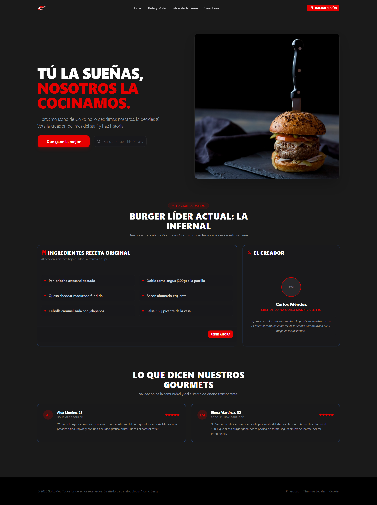

Mapas de calor obtenidos:

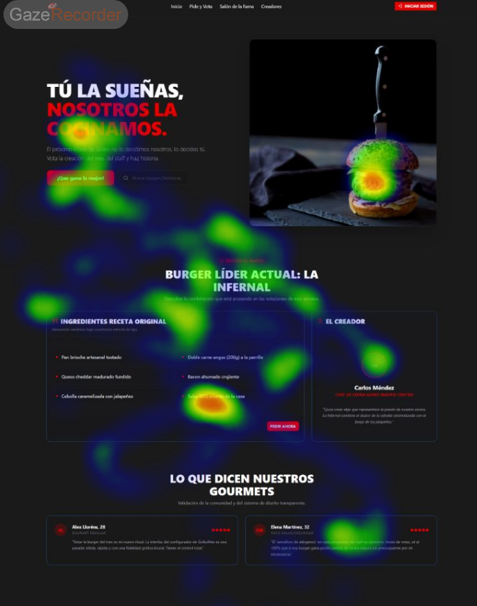

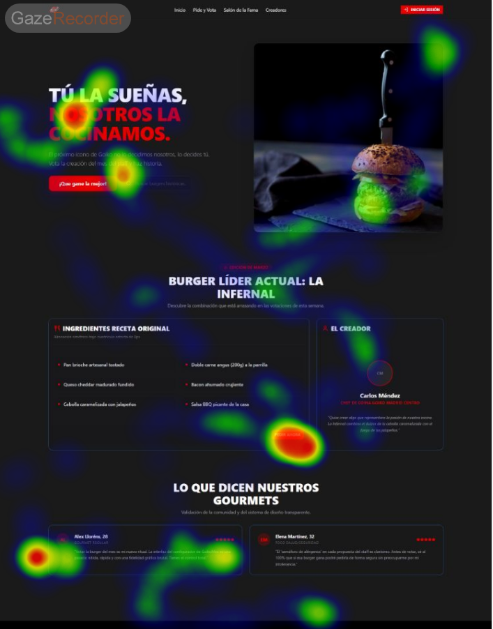

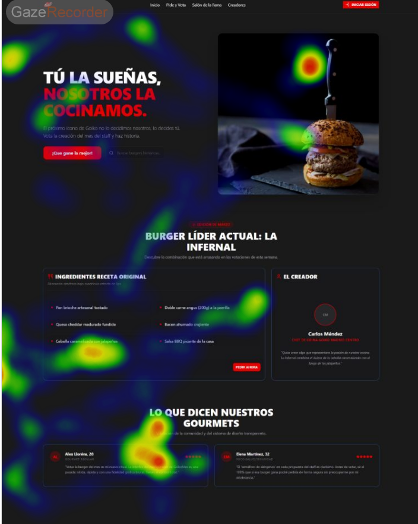

#### Resultados observados

| Participante | Zonas con mayor atención | Zonas con menor atención | Observación principal |
|---|---|---|---|
| P6 | Botón principal, imagen de la hamburguesa, título de la burger líder, ingredientes y bloque del creador | Menú superior, footer y textos legales | La atención se concentra en los elementos centrales de la propuesta, especialmente en el producto y en la información principal de la burger. |
| P7 | Título principal, imagen de la hamburguesa, botón de pedido/votación, botón “Pedir ahora” y reseñas inferiores | Menú superior y parte del texto descriptivo | El usuario identifica con rapidez los elementos interactivos, aunque algunas zonas informativas secundarias reciben menos atención. |
| P8 | Imagen principal de la hamburguesa, título de la burger líder, ingredientes y sección de reseñas | Botón inicial, menú superior y bloque del creador | La mirada se reparte entre el producto visual, la información de ingredientes y la validación social mediante reseñas. |

#### Análisis de los mapas de calor

Los mapas de calor muestran que la interfaz de GoikoMes consigue atraer la atención de los usuarios hacia los elementos visuales más importantes. En los tres casos, la imagen de la hamburguesa aparece como una de las zonas más observadas, lo que confirma que el recurso visual principal cumple correctamente su función de captar la mirada del usuario.

También se observa una atención considerable sobre el título principal y sobre el bloque central donde aparece la hamburguesa líder actual, “La Infernal”. Esto indica que la jerarquía visual de la landing funciona correctamente, ya que los usuarios tienden a recorrer primero las zonas más relevantes para entender la propuesta de la página.

En cuanto a la interacción, algunos mapas muestran fijaciones claras sobre los botones de acción, especialmente el botón inicial y el botón “Pedir ahora”. Esto sugiere que las llamadas a la acción son visibles, aunque no siempre concentran la atención de todos los participantes por igual. En algunos casos, la imagen del producto y los textos principales tienen más peso visual que los elementos accionables.

La sección de ingredientes también recibe atención en varios participantes, especialmente en la parte inferior izquierda de la captura. Esto es positivo, ya que indica que los usuarios no se quedan únicamente en la imagen principal, sino que también consultan información concreta sobre la composición de la hamburguesa.

Por otro lado, el menú superior apenas recibe atención en los tres mapas de calor. Esto puede interpretarse de dos formas: por un lado, la navegación no resulta imprescindible al tratarse de una landing de página única; por otro, puede indicar que el menú queda demasiado discreto visualmente frente al resto de elementos de la interfaz.

Las reseñas de la comunidad reciben atención en algunos participantes, especialmente en la zona inferior, aunque de manera menos constante que la imagen principal o la sección de ingredientes. Esto sugiere que la validación social está presente, pero podría reforzarse visualmente si se quiere que tenga más protagonismo dentro de la experiencia.

#### Conclusiones del Eye Tracking

A partir de los resultados obtenidos, se puede concluir que GoikoMes presenta una jerarquía visual efectiva en sus elementos principales. La imagen de la hamburguesa, el título principal y el bloque de la burger líder concentran gran parte de la atención, lo que facilita que el usuario comprenda rápidamente el objetivo de la página.

Sin embargo, se detectan algunas oportunidades de mejora. El menú superior y ciertos textos secundarios pasan bastante desapercibidos, probablemente por su tamaño reducido y por el fuerte contraste visual que generan las imágenes y los títulos principales. Además, aunque los botones de acción son visibles, podrían reforzarse para asegurar que todos los usuarios identifiquen claramente la acción principal de votar o pedir.

Como recomendaciones de mejora, se propone:

- Aumentar ligeramente el tamaño o contraste del menú superior.
- Reforzar visualmente los botones de acción principales.
- Mejorar la separación entre bloques para facilitar el escaneo visual.
- Dar algo más de protagonismo a las reseñas y elementos de validación social.
- Revisar el contraste de algunos textos secundarios sobre el fondo oscuro para reducir la fatiga visual.

En conjunto, el análisis mediante Eye Tracking muestra que el diseño de GoikoMes tiene un impacto visual fuerte y consigue dirigir la mirada hacia el producto principal, aunque podría mejorar la visibilidad de algunos elementos secundarios y de navegación.

### 4.f Usability Report de B

Se ha elaborado un informe de usabilidad del **Caso B: GoikoMes**, correspondiente a la propuesta asignada para la evaluación cruzada.

El informe recoge los principales resultados obtenidos durante la práctica: reclutamiento de usuarios, tareas realizadas, cuestionario SUS, A/B Testing, Eye Tracking y primeras recomendaciones de mejora. El objetivo no es rehacer el proyecto evaluado, sino detectar sus puntos fuertes y sus posibles debilidades desde el punto de vista de la experiencia de usuario.

El archivo completo del informe se encuentra en:

[Usability Report - GoikoMes](P4/P4_UsabReport_GoikoMes.md)

 

## Paso 5. Exportación y Documentación 

### 5.a Exportación a HTML/React
 
----

El objetivo principal de este proceso ha sido dar vida a la web de La Estantería de Sabores, pasando de los diseños visuales a una aplicación real y funcional con React y Tailwind CSS. Desde el primer momento nos centramos en que la página fuera súper cómoda de usar. Por ejemplo, siguiendo el consejo del profesor sobre experiencia de usuario, rediseñamos los botones de la pantalla de eventos: ahora el botón de "Reservar" destaca muchísimo más (en color sólido) que el de "Compartir" (que es solo un perfil), guiando al cliente de forma natural hacia la reserva, que es lo que le interesa al negocio.
A lo largo del desarrollo nos topamos con varios retos visuales, como ajustar el tamaño de las imágenes para que no rompieran el diseño en pantallas grandes ni obligaran a hacer un scroll infinito. Lo solucionamos limitando las alturas y usando estructuras en columnas para que todo encaje de un solo vistazo. Además, añadimos detalles clave para la identidad de la marca, como meter el logotipo oficial en formato circular en la barra de navegación y redondear los bordes de todas las imágenes (rounded-[32px]) para mantener esa estética rústica, suave y uniforme que se ve en los mockups.
Por último, conectamos todas las secciones mediante el uso de estados en React, logrando que la navegación entre pestañas sea instantánea y fluida. Como broche final, creamos desde cero la pantalla de "Sabores" (de la cual no había mockup previo). Diseñamos un menú interactivo donde el usuario puede alternar entre "Cafés" y "Repostería" con un clic, mostrando los productos en tarjetas súper cuidadas con su precio bien visible y etiquetas especiales (como "Vegana" o "Sin Gluten"), dejando el proyecto con un acabado redondo y totalmente listo.

La aplicación se ha desplegado con éxito en producción a través de la plataforma Surge.sh, quedando pública y operativa para su evaluación en el siguiente enlace:
🔗 [Web La Estanteria de Sabores](https://la-estanteria-de-sabores.surge.sh)

#### Valoración personal del equipo

La tarea nos ha servido para ver el proyecto desde otra perspectiva. Al evaluar GoikoMes no nos hemos quedado solo en si la página era bonita o no, sino en si realmente se entendía bien, si los usuarios encontraban lo importante y si la interfaz era cómoda de usar.

Nos ha llamado la atención que algunos detalles que parecen pequeños, como el contraste de un texto, el tamaño del menú o la posición de un botón, pueden afectar bastante a la experiencia. Además, el Eye Tracking nos ha ayudado a comprobar qué zonas miraban realmente los usuarios y cuáles pasaban más desapercibidas.

En general, creemos que esta evaluación ha sido útil porque nos ha permitido sacar conclusiones más objetivas y no basarnos solo en impresiones personales. También nos ha ayudado a pensar en posibles mejoras para nuestro propio proyecto.

### 5.b Código
----
[Código HTML de la página web](P5)

 

## Conclusiones finales & Valoración de las prácticas

>>> Opinión FINAL del proceso de desarrollo de diseño siguiendo metodología UX y valoración (positiva /negativa) de los resultados obtenidos. ¿Qué se puede mejorar? Recuerda que este tipo de texto se debe eliminar del template que se os proporciona 

